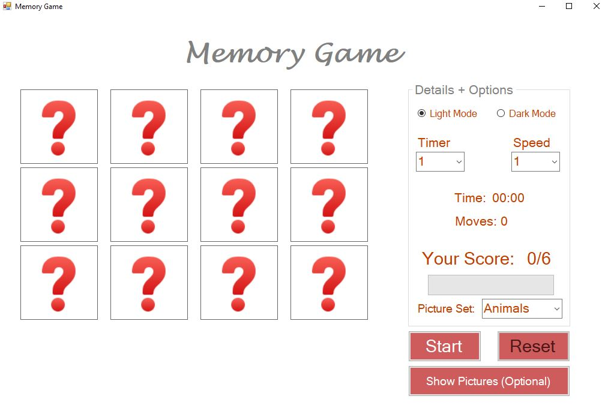
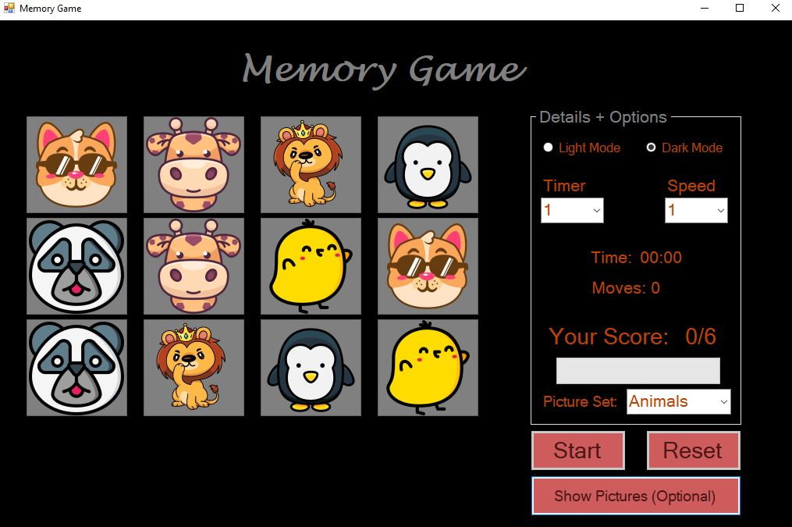
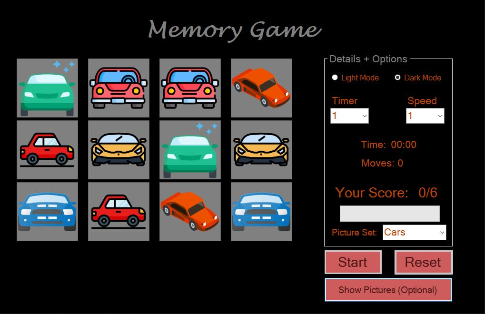
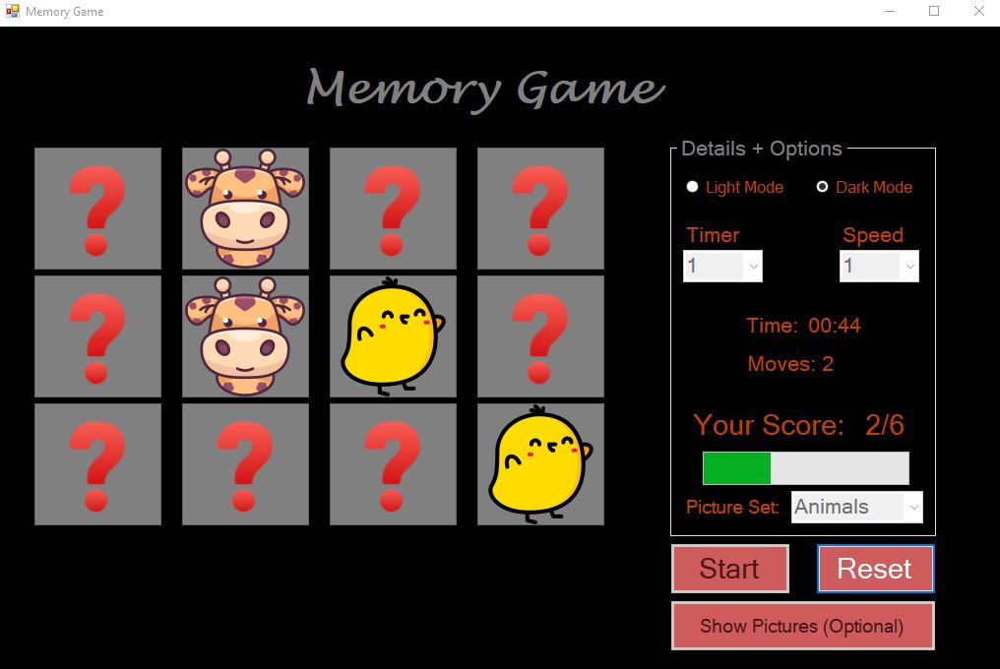

# MemoryGame 🎮

MemoryGame is a classic .NET Windows Forms game where players match pairs of identical images scattered across a board. The challenge is to identify all the matching pairs within a time limit set by the player.

## Features 🌟
- **Engaging Gameplay**: Match 6 pairs of identical images displayed in a grid.  
- **Customizable Timer**: Players set their desired time limit for the game.  
- **Simple Interface**: Intuitive and easy-to-use Windows Forms interface.  
- **Replayable**: Endless fun as the images shuffle with every new game.

## How to Play 📖
1. **Start the Game**: Launch the application.
3. **Set the Timer**: Choose your game's time limit and speed and pick the category of pictures.
4. **Reveal Cards**: Click on tiles to reveal the images.  
5. **Match Pairs**: Find and match all pairs of identical images before the timer runs out.  
6. **Win or Lose**: Complete the game within the time limit to win or try again!

## Live Demo 🔗
Try out the game by downloading it using the link below:  
[Download MemoryGame](https://drive.google.com/file/d/1b29uDuo0wKCpHQUQk_yIOex46IyIjW8W/view?usp=drive_link)  

## Requirements 🛠️
- **.NET Framework**: Version 4.7.2 or higher  
- **Operating System**: Windows 7 or later  

## Installation 🖥️
1. Clone the repository:  
   ```bash
   git clone https://github.com/MarwanDev/MemoryGame.git

## Screenshots 🖼️
Take a look at the game in action:  

### Light Mode  
  

### Show Pictures  
  

### Cars  
  

### Animals  
  


## Contributing 🤝
Contributions are welcome! Here's how you can help:  
1. Fork the repository.  
2. Create a feature branch (`git checkout -b feature-name`).  
3. Commit your changes (`git commit -m 'Add a new feature'`).  
4. Push to the branch (`git push origin feature-name`).  
5. Open a pull request.  

Feel free to open issues for bugs, suggestions, or enhancements.

## License 📜
This project is licensed under the [MIT License](LICENSE).  
